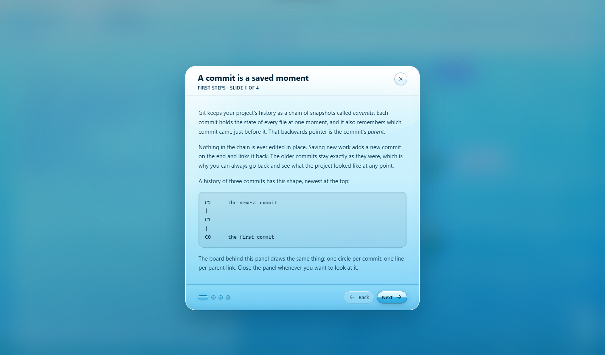
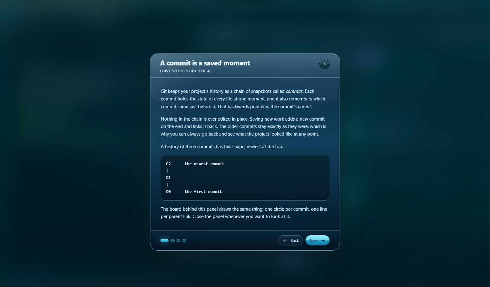

# Learn Git Aero

[](../../actions/workflows/ci.yml)

Learn git branching by doing it. Type real git commands into a terminal and watch a
live commit graph redraw to match, one small lesson at a time.



---

## What this is

I built this because git's model is simple once you can see it, and almost
impossible to hold in your head before that. Branches are labels. Rebasing copies
commits. `HEAD` is just a pointer. Every one of those clicks instantly when you
watch the graph move, and stays muddy no matter how many times you read it.

So: a terminal on one side, a live commit graph on the other, and 37 lessons that
take you from your first commit to the full remote workflow. You run genuine
commands. The graph is the feedback.

It is styled as Frutiger Aero meets glassmorphism — glossy glass panels floating on
sky and water, in a bright **day** theme and a deep **dusk** one.

Everything runs in your browser. No account, no backend, no network requests at all.

---

## Features

**A real git model.** Not a scripted animation. `commit`, `branch`, `checkout`,
`merge`, `rebase` (including `-i` and `--onto`), `reset`, `revert`, `cherry-pick`,
`tag`, `describe`, and the complete remote set — `clone`, `fetch`, `pull`, `push`,
refspecs, upstreams and protected branches. Fast-forward and true merges behave
differently, because they do in git.

**37 lessons across seven sequences**, plus two sandboxes for free play. Each lesson
explains why a command exists before showing you how to type it, and says plainly
where this simulation differs from real git rather than quietly glossing over it.

**A commit graph that stays readable.** Commits at the same depth sit on the same
row, branches fan apart instead of bundling, and every edge points at its parent.
Merges are drawn with a dashed second-parent line. Remote levels show your
repository and the origin side by side on a shared baseline.

**A terminal that behaves like one.** Command history, tab completion with inline
suggestions, reverse search with `Ctrl+R`, and readline editing keys. Errors name
the cause and the fix, with did-you-mean suggestions.

**A goal panel that shows the distance.** Open it and your current tree is ghosted
behind the target, so you can see exactly what still has to move — and it states in
words which refs are being graded.

**Share any repository as a link.** Type `share` and you get a URL carrying the
whole tree, so you can send someone the exact state you are looking at.

<details>
<summary>Accessibility and browser support</summary>

- Fully keyboard operable, with visible focus indicators throughout.
- The commit graph is navigable by keyboard and mirrored into a screen-reader list
  that names each commit, its parents and the refs pointing at it.
- Colour is never the only signal: branches are distinguished by shape and pattern
  as well as hue.
- `prefers-reduced-motion` stops all animation, including the background.
- Responsive from 320px to ultrawide, with 44px touch targets on coarse pointers.
- Targets current Chrome, Edge, Firefox and Safari. No build step, no dependencies,
  no polyfills.

</details>

---

## Running it locally

The app is built from ES modules, which browsers refuse to load over `file://`.
Opening `index.html` by double-clicking will show you a page explaining that rather
than a working app — it has to be served over http.

**Windows:** double-click `start.cmd`.

**Any platform**, from this folder:

```bash
python -m http.server 8099
```

Then open <http://localhost:8099>.

Prefer Node?

```bash
npx --yes serve -l 8099 .
```

---

## Deploying

It is a static site with no build step and no external requests, so any static host
will serve it unchanged.

**GitHub Pages:** push this repository, then go to **Settings → Pages** and select
your branch with `/ (root)` as the folder. Pages serves over https, so the module
restriction above does not apply.

The same applies to Netlify, Vercel, Cloudflare Pages or plain S3 — point them at the
repository root and there is nothing to configure.

---

## Tests

The suite runs on Node's built-in test runner. There is nothing to install.

```bash
node --test
```

**275 tests**, in two groups:

- **Behaviour.** The git engine is tested against what real git does — fast-forward
  versus true merges, rebase across a merge commit, ref resolution like `HEAD~2^1`,
  the full remote flow, undo integrity, and a fuzz pass asserting the parser never
  throws on hostile input. Every one of the 37 lessons is replayed through the engine
  to prove its stored solution actually solves it.
- **Integrity.** Static checks over the shipped files: every module import and asset
  reference resolves, the element ids the modules bind to still exist in the markup,
  no stylesheet declares a colour outside the token file, and nothing anywhere
  reaches the network.

GitHub Actions runs both on every push, plus a headless browser smoke test that boots
the app, executes a sequence of git commands, asserts the rendered graph agrees with
the engine's state, and fails the build on any console error. The workflow is in
[`.github/workflows/ci.yml`](.github/workflows/ci.yml).

---

## Project structure

```
index.html          The page. Frozen element ids the modules bind to.
css/
  tokens.css        Design tokens. The only file containing literal colours.
  base.css          Reset, layout, typography, focus, reduced motion.
  aero.css          The glass component system and the animated background.
  tree.css          Commit graph.
  terminal.css      Terminal.
  modals.css        Dialogs, level browser, toasts, help.
js/
  main.js           Application shell: level lifecycle, command routing, wiring.
  core/             Event bus, storage, shared helpers, markdown renderer.
  git/              The git engine: parser, commands, repository model, comparison.
  view/             Commit graph, terminal, modals, lesson dialog, level browser.
  levels/           The 37 lessons, in seven sequences.
assets/             Icon sprite and favicon.
start.cmd           Local server launcher for Windows.
```

The modules are deliberately decoupled. The engine never touches the DOM; it exposes
plain-data snapshots. The graph renders a snapshot and knows nothing about git. The
shell is the only place they meet.

---

## Themes



Switch with the **Theme** button, or type `theme dusk` in the terminal. Your choice
persists, along with your progress, terminal history and pane sizes.

---

